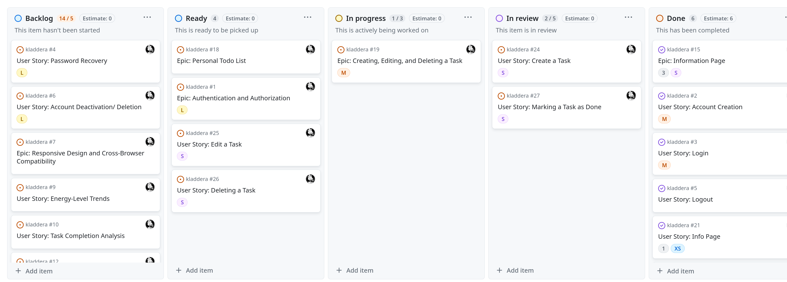

# Kladerradatsch
Redefining Task Management for Mental Well-being.
In a world where productivity apps often add to the stress rather than alleviate it, Kladerradatsch was designed with a deep understanding of the challenges faced by individuals battling depression.

At its core, Kladerradatsch acknowledges the variability of human energy levels. Unlike traditional task managers that demand relentless productivity regardless of one's mental state, Kladerradatsch adapts to the user's fluctuating energy resources throughout the day.

Imagine a tool that empowers users to seize the high-energy days for tackling tasks and ambitions with fervor. Yet, equally important, Kladerradatsch gently reminds users to prioritize self-care and basic needs during low-energy periods, recognizing that productivity should never come at the cost of well-being.

## Content

<!-- toc -->

## Technologies Used

* GitHub – storage and deployment
* Sublime Text - Editor
* Heroku - Deployment

### Languages Used

JavaScript, HTML/CSS

### Frameworks, Libraries & Programs Used

* [React](https://react.dev/), as JS Framework
* [Tailwind CSS](https://tailwindcss.com/), as CSS framework for easier management of styling throughout the project
* [Node JS](https://nodejs.org/en), as runtime environment
* [axios](https://axios-http.com/docs/intro), as HTTP Client
* [axios-jwt](https://www.npmjs.com/package/axios-jwt), as library to Store, clear, transmit and automatically refresh JWT authentication tokens. For easy and secure authentication.

## Project Goals

### Promoting Mental Well-being
The application aims to prioritize the mental well-being of users by considering their energy levels. By breaking down tasks into manageable portions, it aims to prevent overload.

### Self-Awareness and Empowerment
One goal is to encourage users to become more self-aware of their energy levels and task capacities. Through prompting users to consider the energy consumption of tasks, the application aims to facilitate self-reflection and understanding, empowering users to make informed decisions about their productivity.

### Respect for Personal Achievements
Lets believe in acknowledging and celebrating individual accomplishments, regardless of how they may be perceived by others. The application seeks to instill a sense of respect for personal achievements, recognizing that what may seem like a small task to others can be significant for an individual.

## User Experience
In a market saturated with productivity apps, Kladerradatsch stands out as a testament to empathy-driven design.

### Target Audience
Kladerradatsch caters to a specific demographic whose needs are often overlooked in the realm of productivity apps. Our target audience encompasses individuals who:

#### Struggle with Mental Health Challenges
The primary focus of Kladerradatsch is to provide support for individuals battling depression, anxiety, or other mental health conditions. These individuals often find it challenging to maintain a consistent level of productivity due to fluctuations in mood, energy, and motivation.

#### Experience Energy Variability
The target audience comprises individuals who recognize the variability of their energy levels throughout the day. They understand that some days are filled with boundless energy and optimism, while others are marked by fatigue and low motivation. Kladerradatsch empowers these individuals to make the most of their high-energy days while respecting their limitations on low-energy days. This applies also to people working in shift work, or having a chronical illness.

## Project

### Workflow
In the development process, a Kanban board in form of a [github project](https://github.com/users/DasUnicorn/projects/3) is used to manage the tasks and track their progress. Initially, all issues are collected and placed in the backlog. During each iteration, a set number of issues are selected to be developed and assigned to the current milestone. These selected issues are then moved to the 'Ready' column on the Kanban board, indicating that they are ready to be worked on.

When working on the tasks begins, the status of the issues is updated to 'In Process'. This signifies that active development is underway. Once the development work is completed, the issues move to the 'In review' column, where they undergo thorough testing to ensure the acceptions criterias are met.

If an issue passes testing successfully, it is considered 'Done' and is moved to the final column on the Kanban board and closed.

### Epics
Sadly GitHub does not support epics.
Therefore Epics have been created as a separate Issue, containing a list of all User Stories belonging to this Epic.
They have the label "epic" to filter for them.

### User Stories
Features in this project are structured through [user stories](https://github.com/DasUnicorn/kladdera/issues?q=is%3Aissue).
Each User Story contains:
- **Dependencies:** This field indicates any external factors or requirements that need to be fulfilled before the user story can be implemented in a form of a list of other user stories.
- **Description Of Service Or Screen:** This field typically describes the specific service, feature, or screen that the user story relates to.
- **User Objective:** This field outlines the user's goal or objective. It should clearly state what the user wants to achieve or accomplish. The format follows: "As a user, I want to [action], so that [reason or benefit]." With this Objective in mind, User Stories are created to align with the target audience.
- **Acceptance Criteria:** This field specifies the conditions or criteria that must be met for the user story to be considered complete. It helps define the boundaries and expectations for implementing the user story.

## Design
The elegant simplicity of the [Apple Watch typography](https://support.apple.com/de-de/guide/watch/apde9218b440/watchos) left an impression, serving as the cornerstone of Kladerradatsch's design philosophy. Embracing clean lines, minimalistic elements, and intuitive layouts, our design exudes a sense of calmness.
At the heart of Kladerradatsch lies a neutral palette. Against this backdrop, pops of vibrant color emerge for modern energy.
Building upon the foundation of simplicity, Kladerradatsch incorporates elements of modern abstract art, geometric shapes, fluid lines, and subtle textures.

### Wireframes
The design centers around an information page, authentication (login, sign up, logout,...).At the core is the  todo list, displaying task count and energy level represented by emojis. Tasks are assigned energy levels, and the app structure updates the tasklist.

### Prototype
The [Figma prototype](https://www.figma.com/proto/ENgzmzZwR5S0Pv1V36nPz9/Untitled?type=design&node-id=1-3&t=a6WJ1wY2j5e49iV5-1&scaling=scale-down&starting-point-node-id=54%3A4&show-proto-sidebar=1&mode=design) offers a glimpse into Kladerradatsch's design idea. 

## Features

* SignUp, Login and Logout as a user
* Tasklist
* Create, Update and Delete a Task
* Update Tasklist, by changing emojis
* Mark Task as done and undone
* Create, Edit Delete a Mood

## React Components

The following components have been used in this application:
* A Navbar, used in all sites for navigation
* A Task Design that is used in all task list and provides a task with it's functionality.
Using components avoid code repetition, for easier mantainance.

## Testing

### eslint result

<pre><u style="text-decoration-style:single">/home/lana/Projects/kladdera/src/components/Task.js</u>
  4:17  error  &apos;task&apos; is missing in props validation                   react/prop-types
  4:23  error  &apos;onTaskUpdate&apos; is missing in props validation           react/prop-types
  5:10  error  &apos;task.id&apos; is missing in props validation                react/prop-types
  5:14  error  &apos;task.title&apos; is missing in props validation             react/prop-types
  5:21  error  &apos;task.energy_level&apos; is missing in props validation      react/prop-types
  5:35  error  &apos;task.is_repeating&apos; is missing in props validation      react/prop-types
  5:49  error  &apos;task.completed_at&apos; is missing in props validation      react/prop-types
  5:63  error  &apos;task.repeat_frequency&apos; is missing in props validation  react/prop-types
  5:81  error  &apos;task.user&apos; is missing in props validation              react/prop-types

<u style="text-decoration-style:single">/home/lana/Projects/kladdera/src/contexts/CurrentUserContext.js</u>
  11:39  error  &apos;children&apos; is missing in props validation  react/prop-types

<u style="text-decoration-style:single">/home/lana/Projects/kladdera/src/pages/Home.js</u>
  87:12  error  Missing &quot;key&quot; prop for element in iterator  react/jsx-key

<b>✖ 11 problems (11 errors, 0 warnings)</b>
</pre>

### Manuel Testing
| Feature                       | Expected Outcome                                                                                                                                                                                     | Testing Performed                                                                                                                | Result                                                                | Pass/Fail |
|-------------------------------|------------------------------------------------------------------------------------------------------------------------------------------------------------------------------------------------------|----------------------------------------------------------------------------------------------------------------------------------|-----------------------------------------------------------------------|-----------|
| Sign Up                       | When the User is signing up with valid credentials, an account should be created. After Signing up, the User is logged in.                                                                           | Signing up with email = test@test.de,  password = Secure123!                                                                     | The User is logged in. An Account has been created.                   | Pass      |
| Invalid Sign Up               | When the User is signing in with invalid credentials, they get informed about the invalid data.                                                                                                      | 1. email = test.test.de, password = 123 2. email = test@test.de, no password 3. no email, password = Secure123!                  | The User gets informed about an invalid email and password.           | Pass      |
| Login                         | Can login in with the correct password and username.                                                                                                                                                 | Login with username = test@test.de,  password = Secure123!                                                                       | User is logged in.                                                    | Pass      |
| Invalid Login                 | Users can't login with invalid credentials.                                                                                                                                                          | 1. Login with username = test@test.de, password = InSecure123! 2. try to log in without email. 3. try to login without password. | The user is not logged in.                                            | Pass      |
| Logout                        | After Confirming to logout, the user gets logged out.                                                                                                                                                | Pressing Button to confirm the logout.                                                                                           | User is logged out.                                                   | Pass      |
| Create Task                   | A Task has been created. The User gets notified. The User is redirected to the todo list.                                                                                                            | 1. Create a new task without frequency. 2. Create a new task with frequency.                                                     | The Task has been created. The user is notified and redirected.       | Pass      |
| Create Invalid Task           | The user is notified what information is wrong or missing.                                                                                                                                           | 1. Create a new app, leaving title empty.                                                                                        | the task does not get created.                                        | Pass      |
| Edit a Task                   | When clicking on the edit button next to task in the settings, the user can update the information of a task. A task is successfully updated, the user gets notified and redirected to the settings. | Navigate to the settings, select a task, update all info fields, save.                                                           | the change is made, user gets notified and redirected                 | Pass      |
| Edit a Task with invalid Data | When clicking on the edit button next to task in the settings, the user can update the information of a task. A task is not updated, the user gets notified and is not redirected to the settings.   | Navigate to the settings, select a task, update info fields with invalid data, save.                                             | the change is not made, user gets notified and is not redirected      | Pass      |
| Delete a task                 | When clicking on the delete button next to task in the settings, the user can delete the task. After confirmation, the task is deleted, the user gets notified and the list updates..                | Navigate to the settings, select a task, press the delete button.                                                                | a confirmation is shown, after pressing yes, the task gets deleted    | Pass      |
| Not Delete a task             | When clicking on the delete button next to task in the settings, the user can delete the task. After choosing 'no' in confirmation, the task is not deleted.                                         | Navigate to the settings, select a task, press the delete button.                                                                | a confirmation is shown, after pressing no, the task gets not deleted | Pass      |
| Mark a task es done           | When clicking on the checkbox of a task, the task dissappeares.                                                                                                                                      | Click on the checkbox of a task in the tasklist.                                                                                 | task dissaperas.                                                      | Pass      |
| Mark a task as undone         | When clicking on a checkbox of a done task in the settings, the task gets undone.                                                                                                                    | click on a done task in the settings                                                                                             | task is marked undone.                                                | Pass      |
| Select an emoji               | When clicking on the emoji, the user can select other emojis. Depending on the emoji choice the tasklist updates.                                                                                    | click on the emoji, select a couple of different emojis.                                                                         | the tasklist updates.                                                 | Pass      |
| Create a mood                 | When filling out the form and submitting the mood, this should be displayed in the settings                                                                                                          | Fill out the form and submit                                                                                                     | submitting a modd reults in the mood being shown in the settings      | Pass      |
| Edit a mood                   | When a user in the settings, clicks on edit next to a mood, the modd can be edited and the changes saved                                                                                             | Press the edit button, change the fields, press submit                                                                           | editing a mood results in an edit                                     | Pass      |
| delete a mood                 | Whhen a user clicks on delete next to a mood, the mood should be deleted after confirmation                                                                                                          | press the delete button, confirm                                                                                                 | deleting a mood, deletes a modd                                       | Pass      |

## Deployment

### Local Deployment
1. Clone the git repository
2. Navigate into your local project folder
3. Install the dependencies with 'npm install'
4. Start the application with 'npm start'

### Heroku Deployment
1. Login, or sign up to [Heroku](heroku.com)
2. Create a new App
3. Connect the App to your Github Repository
4. If not set automaticly, set the heroku/nodejs Buildpack
5. User the Heroku Deploy for deployment

## Bugs

### Navbar is not refreshing
After logging in or out, or basically everytime the state of the user changes

## Credits:
* https://www.material-tailwind.com/docs/react/
* Graphics: https://www.freepik.com/free-vector/geometric-wallpaper_10423742.htm#fromView=search&page=7&position=1&uuid=8652eecc-bed0-4938-a4e7-0d46a57c165a
* Typograph Apple Watch Design https://support.apple.com/de-de/guide/watch/apde9218b440/watchos
* SVG Icons https://www.svgrepo.com/svg/526462/
* CSS Modules https://medium.com/@ralph1786/using-css-modules-in-react-app-c2079eadbb87
* https://react-icons.github.io/react-icons/
* Navbar https://medium.com/@ryaddev/build-responsive-navbar-with-tailwind-css-and-react-icons-3b13a272dec4
* https://github.com/remix-run/react-router
* routing https://www.youtube.com/watch?v=Ul3y1LXxzdU
* https://flowbite.com/blocks/marketing/register/ Sign up form
* https://flowbite.com/blocks/marketing/login/ login form
* https://blog.logrocket.com/how-to-use-axios-post-requests/
* https://stackoverflow.com/questions/69953377/react-router-v6-how-to-use-navigate-redirection-in-axios-interceptor
* https://www.npmjs.com/package/axios-jwt
* https://stackoverflow.com/questions/33772947/django-set-range-for-integer-model-field-as-constraint
* https://stackoverflow.com/questions/31173324/django-rest-framework-update-field
* https://stackoverflow.com/questions/58114855/handling-select-options-in-react-hooks
* https://stackoverflow.com/questions/74784441/how-to-show-validation-errors-for-a-login-form-when-fields-are-empty-on-submit
* https://stackoverflow.com/questions/68169568/react-form-validation-for-empty-field-with-state
* https://stackoverflow.com/questions/67045902/how-to-create-a-confirmation-delete-popup-in-react